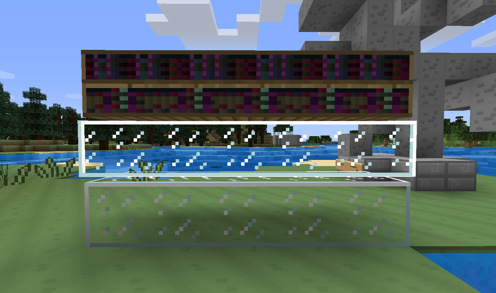

# 01 March 2012
Hazzat - Minecraft 1.2.

Minecraft 1.2 is here, and so is the new L&T update!

New things:
- Redstone lamp
- Circle stone brick
- Jungle wood
- Jungle leaves
- Jungle sapling

Updated things:
- New title screen background
- The experience bar is now a rainbow
- Stone bricks (regular, mossy and cracked) are finally in a state I can feel happy with!
- Magma creams are purple to match slimeballs
- Rotten flesh (still not happy with it though)
- Tamed wolves look less creepy
- Cows look a bit better
- Gold nuggets are now bits (I know you RPers like using them as money)
- The default Steve skin makes you a pony with Mine Little Pony, and it looks better than it did in the last update

​Misc:
- It's also now compatible with Optifine's new "connected textures" setting! So y'all can go wild with that.

