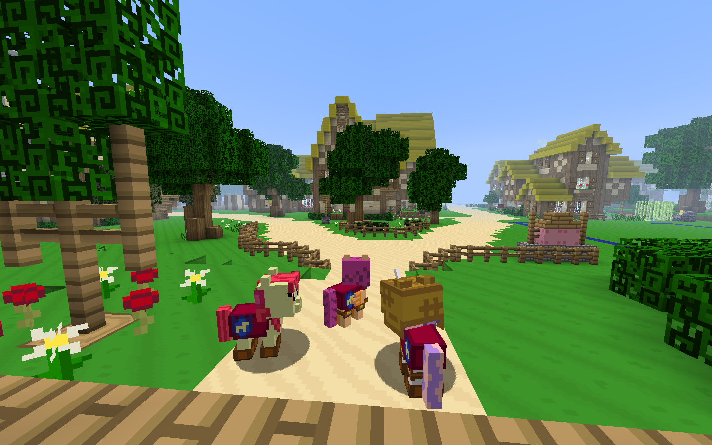
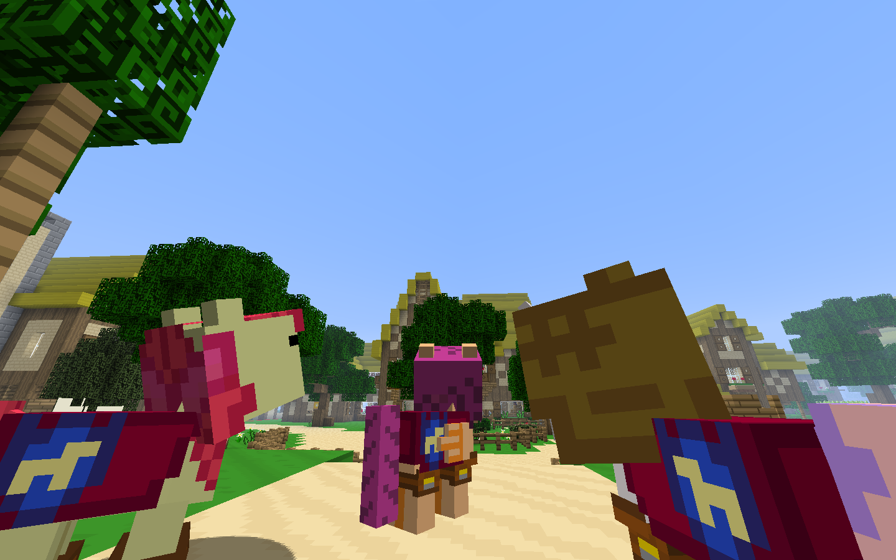
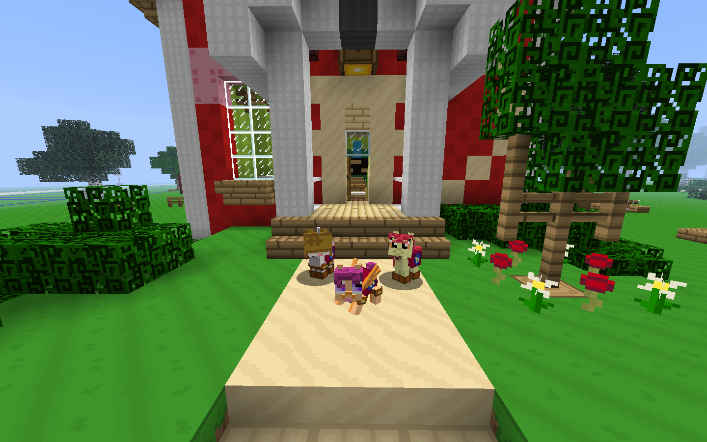
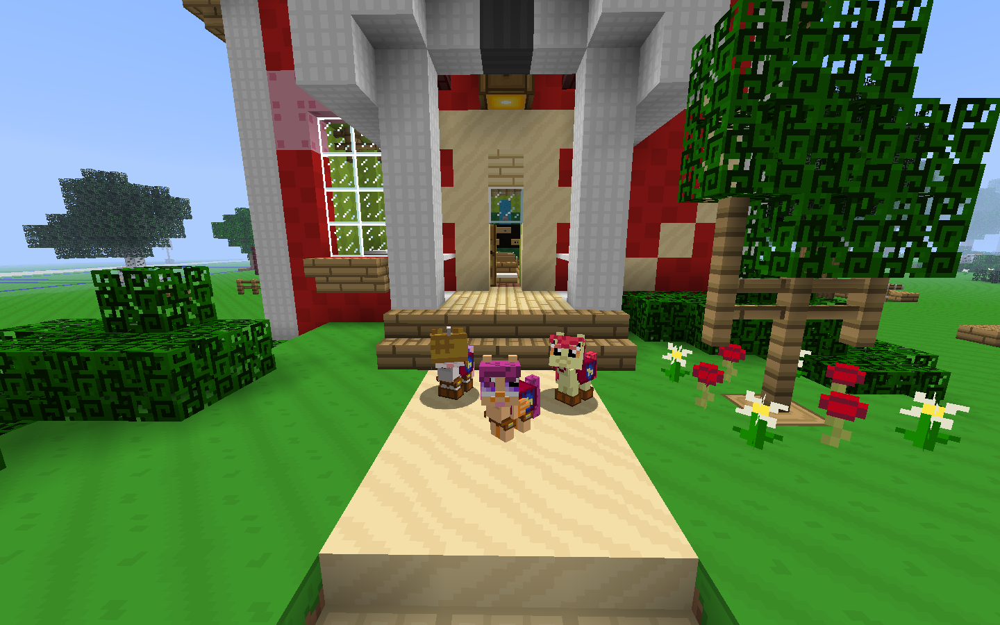
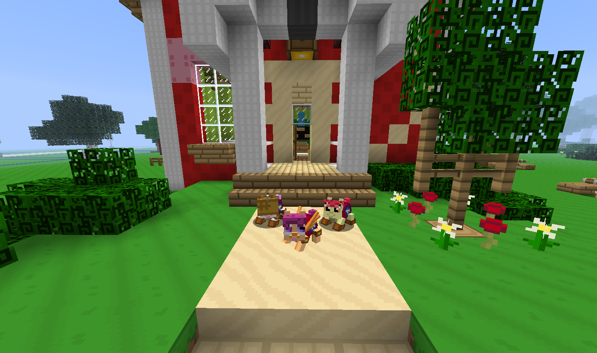
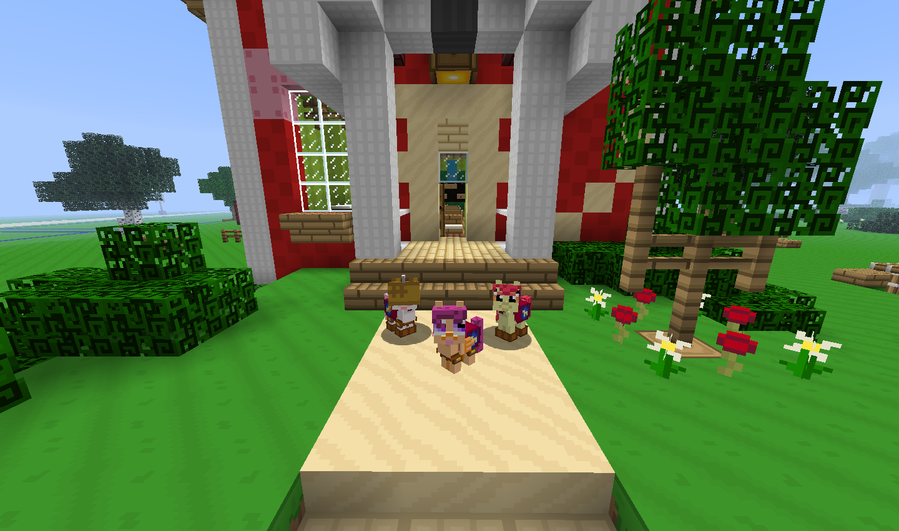

# 09 August 2012
Hazzat - Minecraft 1.3 - part 2.

Update!

Do you use Mine Little Pony? Seeing as you're looking at a page for a pony-themed texture pack on a pony-themed forum for a pony-themed Minecraft server, chances are you do. If you use MineLP, this update is relevant to you!

The new MineLP update features a new shape for armour on ponies that actually fits them properly. Previously it would borrow the helmet and chestplate textures and put them on the pony, which would look a little odd and meant you wouldn't be able to see the whole texture. But no longer!

More cutesy-wootsey CMC screenshots here

 
<!-- leave the empty line below this -->

 

The new armour shape will only show up if your texture pack supports it, and this update does!

New textures:
- Pony armour (all types - leather, iron, gold, diamond, chain)

Updated textures:
- Redstone lamp

Misc:
- Halved the file size
