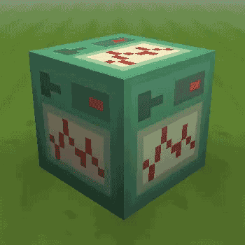

# 26 October 2012
Hazzat - Minecraft 1.4.

The 1.4 update is here!

The mammoth changelog:

New things!
- Item frames
- Flower pots
- Command block - Animated! (Required MCPatcher)
- Anvil
- Potato
- Poisonous potato
- Baked potato
- Carrot
- Golden carrot
- Carrot on a stick
- Potato plants
- Carrot plants
- Pumpkin pie
- Glass bottles
- Potions
- Splash potions
- Wither skeleton
- Witch
- Bat
- Zombie
- Zombie villager
- Blaze
- Empty map
- Villager love/hate particles
- Beacon
- Beacon beam
- "Steve" skin
- Painting
- HD font (finally)

Updated things!
- Moon (back to how it was in 1.2)
- Melon
- Pumpkin
- Brewing stand
- Chest
- Double chest
- Emerald block
- Leather armour - Dyeable, but is now all brown by default
- Raw (Jutsy) fish
- Cooked (Jutsy) fish
- Written book
- Minecart with chest
- Wolves

And probably more stuff that I can't remember right now!

A lot of work for this update was done by Hawkseye21 while my computer was broken. He did a brilliant job, so if you see him around send him some love!

We hope you like it!

