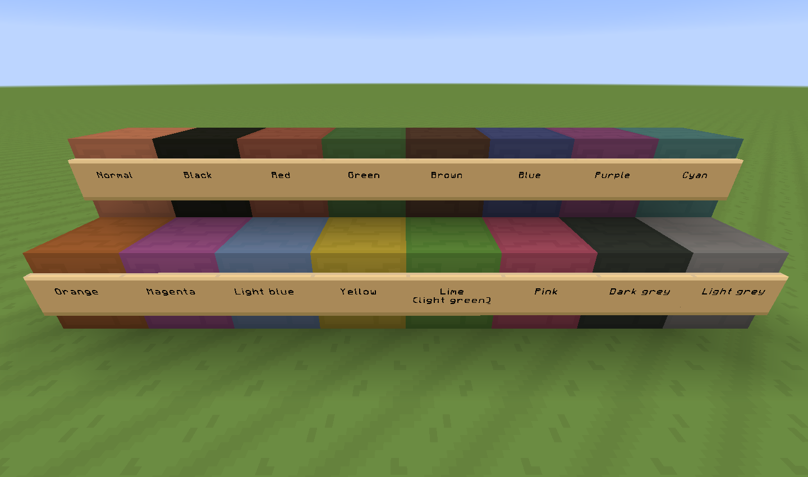

# 13 February 2014
Hazzat - Minecraft 1.7.4

1.7.4 UPDATE! It's been a far-too-long time coming, I know.

We've got:
- Custom records! Now the in-game records play remixes of MLP songs, or MLP-inspired songs.
- Flowers! (sunflower, daisy, tulip, azure bluet, allium, blue orchid, lilac, rose bush, peony)
- Other plants! (double tallgrass, large fern, acacia sapling, big oak sapling)
- Trees! (acacia logs, big oak logs, acacia planks, big oak planks)
- Podzol...!
- Stained glass!
- Packed ice!
- Fish! (salmon, cooked salmon, pufferfish, clownfish)
- Cave spiders are star spiders

Thank you for sticking around. L&T isn't dead, and I hope to keep working on it for many updates to come.

On top of that, I redid the stained clays so they look more like the colours they're meant to be:

I edited the font to round it off a bit, and toned down references in item names, as I figured they could get annoying for some people.

Download from Planet Minecraft

But wait, there's more! There's are music-free and music-only versions for people who like to customise their Minecraft. You can read about them in the first post.

As usual, MCPatcher is recommended so you get all the features.

Thank you for sticking around. L&T isn't dead, and I hope to keep working on it for many updates to come.
